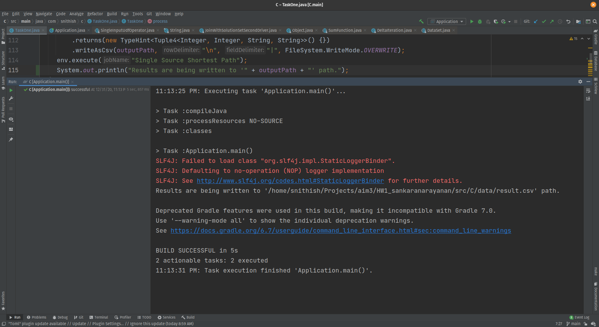

# Output

## Compilation Result

Below screenshot serves as documentation for successful compilation.


## Result

A snippet of the output is captured here, complete output can be viewed in the [here](data/result.csv).

```text
17274|2950|17274, 4416, 3630, 8768, 21379, 6934, 25215, 5359, 2950|8
17274|22876|17274, 4416, 23939, 23107, 19865, 12491, 22876|6
17274|15802|17274, 4416, 2155, 25172, 5078, 21130, 15802|6
17274|20782|17274, 4416, 13142, 15880, 3804, 17194, 20782|6
17274|10446|17274, 4416, 21798, 24293, 5385, 18723, 10446|6
17274|14840||Inf
17274|21333|17274, 4416, 9889, 18579, 21333|4
17274|18621||Inf
17274|19464|17274, 4416, 21798, 20850, 10427, 20613, 19464|6
17274|1151|17274, 4416, 25006, 1588, 18540, 17082, 6823, 1151|7
17274|4376|17274, 4416, 25006, 1588, 10652, 4376|5
17274|20101|17274, 4416, 9889, 17655, 12365, 15552, 3872, 20101|7
17274|6222|17274, 4416, 9889, 16906, 2443, 7650, 6222|6
17274|6443||Inf
```