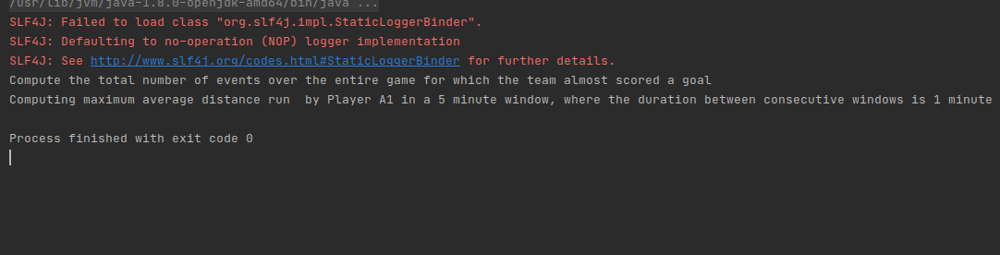

## Flink Streaming output

 
 **Successful Compilation**
 
- The displayed screenshot is taken from successful compiation of the programs 

 

             Figure1: Program successful compilation

#### How to execute the program
 - Import as a maven project
 - Provide path to the input file in the program arguments
 - Run the program 

### Final Compilation Results
- Results are saved to the [Data](Data) folder

 Taskone: 
 <pre>
 10860000 11160000 11.413273253376596
</pre>

Tasktwo  
 <pre>
TeamA  927128  
TeamB  1170620
</pre>

