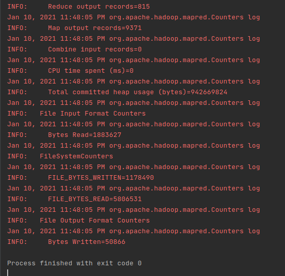
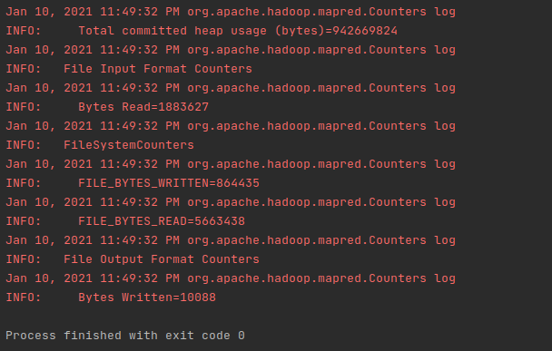

# Mapreduce Ouput

 **Successful Compilation**
 
- The displayed screenshot is taken from successful compiation of the programs

      ===

    Figure 1:Program successful compilation  

 - **Task two sampe output:**  
 

<pre>
     Name           Address         Average Price
Customer#000000100,fptUABXcmkC5Wx,183088.232	
Customer#000001001,KbWTzGB3ZUymu nNCIuG5eCueaqu,135773.7757142857	
Customer#000001003,lE07lPMzVzMhG9CUC54uPwGw3BWO,148510.95555555556	
Customer#000001004,mBaNGEJoY2tgXD60V2DEO ajjoM3Zd,Jp,210084.8025	
Customer#000001006,Q46palcsa4KwAMhPS,127886.11999999998	
Customer#000001007,PfH0lw8GzD7o,117057.77000000002	
Customer#000000101,sMmL2rNeHDltovSm Y,145864.20727272728	
Customer#000001010,uasIK CZZ5,205723.59
</pre>

- **Task two output:**
  

<pre>
 Name
Customer#000001002	
Customer#000001005	
Customer#000001008	
Customer#000001011	
Customer#000001014	
Customer#000001017	
Customer#000000102	
Customer#000001020	
Customer#000001023	
Customer#000001026

</pre>

- Complete output of both tasks can be viewed in the [Data](Data) folder