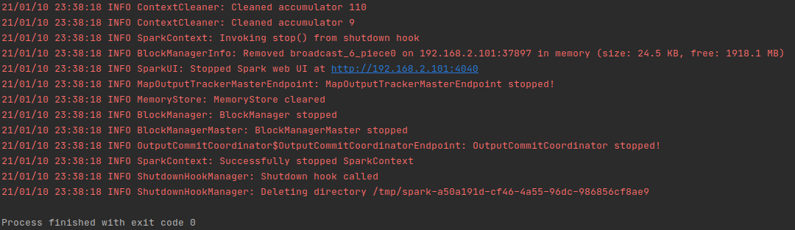
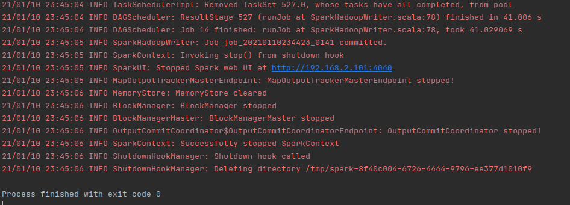

## Spark Output

** Successful compilation**
- The displayed screenshot is taken from successful compiation of the program for both tasks

=====================

    
    Figure 1: Program successful compilation

## Sample Output

 **Task One output:**

<pre>

(451,Customer#000000451,ZJKTC1Ck,B01fYZ xdN2,134579.522)
(454,Customer#000000454,d9oQCm3onNsFlIoteVjFcQDv,126334.54199999999)
(1084,Customer#000001084,E091r836A8TPqn5,152526.04499999998)
(772,Customer#000000772,TBxlR0AAHeSYl0vyK 8joF,190175.09900000002)
(752,Customer#000000752,KtdEacPUecPdPLt99kwZrnH9oIxUxpw,147814.39250000002)
(586,Customer#000000586,vGaA9XBtn,hlswFhSjLIXGlLEDD2flE8UXwj,127523.19000000002)
(667,Customer#000000667,oQqeEC,OD9XC1JXyOsHqcpv0fPUdP9ek5KKb70tQ,141808.60428571427)

</pre>

- **Task two output:**

<pre>

13649|17274,4416,9889,21012,6610,22527 | 6
22119|17274,4416,23939,23107,19865,21910 | 6
25628|17274,4416,9889,21012,4164,2239,25069,21927 | 8
12318|17274,4416,25006,12545,24057,12786 | 6
8079|17274,4416,9889,21012,18208,11461 | 6
15829|17274,4416,13142,13096,10762,11712 | 6
2770|17274,4416,17187,24559,23038,12654 | 6
2771|17274,4416,25006,13276,7689,22426 | 6
2773|17274,4416,25006,13801,16647,8511 | 6
4952|17274,4416,25006,13801 | 4

</pre>

Complete output result can be found inside the [Data](Data)